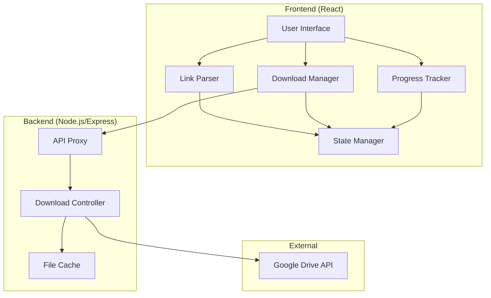
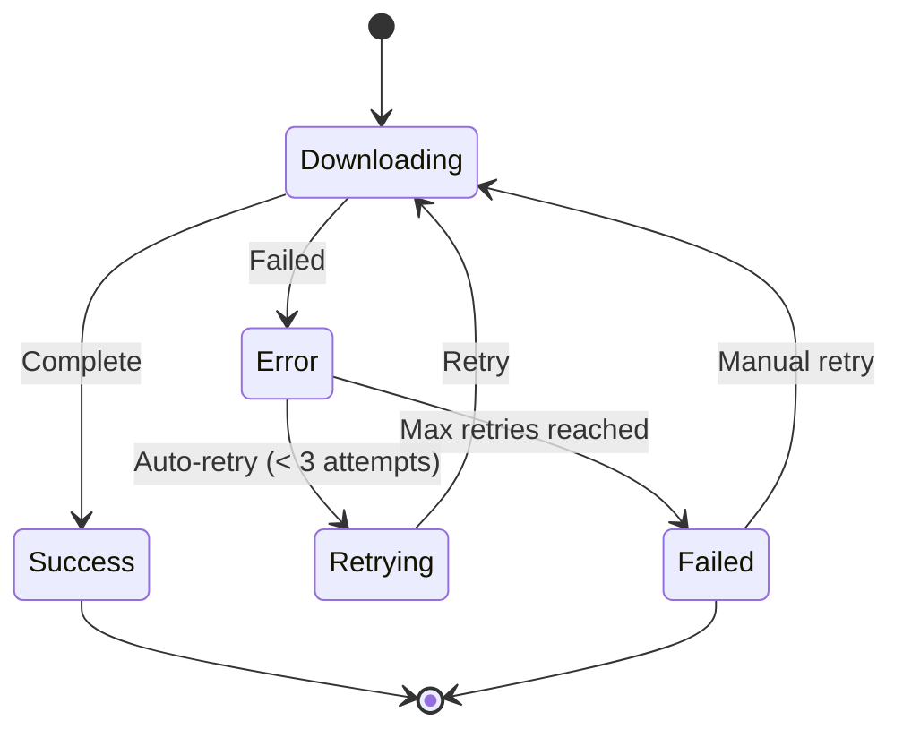

# Design Document: Google Drive Downloader

## Overview

Aplikasi web React yang memungkinkan pengguna mendownload file dan folder dari Google Drive dengan mudah. Aplikasi ini menggunakan arsitektur client-side dengan backend proxy untuk mengatasi CORS dan rate limiting dari Google Drive API.

## Architecture



## Components and Interfaces

### Frontend Components

#### 1. LinkInput Component
```typescript
interface LinkInputProps {
  onLinkSubmit: (link: string) => void;
  isLoading: boolean;
}

interface ParsedLink {
  type: 'file' | 'folder';
  id: string;
  originalUrl: string;
}
```

#### 2. FilePreview Component
```typescript
interface FileMetadata {
  id: string;
  name: string;
  mimeType: string;
  size: number;
  modifiedTime: string;
  iconLink?: string;
}

interface FolderMetadata {
  id: string;
  name: string;
  files: FileMetadata[];
  totalSize: number;
}

interface FilePreviewProps {
  metadata: FileMetadata | FolderMetadata;
  onDownload: () => void;
  isLoading: boolean;
}
```

#### 3. DownloadProgress Component
```typescript
interface DownloadProgress {
  fileId: string;
  fileName: string;
  progress: number; // 0-100
  speed: number; // bytes per second
  status: 'pending' | 'downloading' | 'completed' | 'failed';
  error?: string;
}

interface DownloadProgressProps {
  downloads: DownloadProgress[];
  onRetry: (fileId: string) => void;
  onCancel: (fileId: string) => void;
}
```

#### 4. DownloadQueue Component
```typescript
interface QueueItem {
  id: string;
  metadata: FileMetadata;
  status: 'queued' | 'downloading' | 'completed' | 'failed';
  progress: number;
}

interface DownloadQueueProps {
  queue: QueueItem[];
  onRemove: (id: string) => void;
  onClearCompleted: () => void;
}
```

### Backend API Endpoints

#### GET /api/metadata/:fileId
Fetches file or folder metadata from Google Drive.

```typescript
interface MetadataResponse {
  success: boolean;
  data?: FileMetadata | FolderMetadata;
  error?: {
    code: string;
    message: string;
  };
}
```

#### GET /api/download/:fileId
Initiates file download with streaming support.

```typescript
interface DownloadResponse {
  // Streams file content with proper headers
  // Content-Disposition: attachment; filename="..."
  // Content-Length: ...
}
```

#### GET /api/folder/:folderId/files
Lists all files in a folder.

```typescript
interface FolderFilesResponse {
  success: boolean;
  data?: {
    folderId: string;
    folderName: string;
    files: FileMetadata[];
  };
  error?: {
    code: string;
    message: string;
  };
}
```

### Services

#### LinkParserService
```typescript
class LinkParserService {
  static parse(url: string): ParsedLink | null;
  static isValidGoogleDriveUrl(url: string): boolean;
  static extractFileId(url: string): string | null;
  static extractFolderId(url: string): string | null;
}
```

#### DownloadService
```typescript
class DownloadService {
  fetchMetadata(id: string, type: 'file' | 'folder'): Promise<FileMetadata | FolderMetadata>;
  downloadFile(fileId: string, onProgress: (progress: number) => void): Promise<Blob>;
  downloadFolder(folderId: string, onProgress: (fileId: string, progress: number) => void): Promise<void>;
}
```

## Data Models

### State Management (React Context/Zustand)

```typescript
interface AppState {
  // Current input
  currentLink: string;
  parsedLink: ParsedLink | null;
  
  // Metadata
  metadata: FileMetadata | FolderMetadata | null;
  isLoadingMetadata: boolean;
  metadataError: string | null;
  
  // Downloads
  downloads: Map<string, DownloadProgress>;
  
  // Actions
  setLink: (link: string) => void;
  fetchMetadata: (id: string, type: 'file' | 'folder') => Promise<void>;
  startDownload: (fileId: string) => void;
  cancelDownload: (fileId: string) => void;
  retryDownload: (fileId: string) => void;
  clearCompleted: () => void;
}
```

### API Error Codes

```typescript
enum ErrorCode {
  INVALID_LINK = 'INVALID_LINK',
  FILE_NOT_FOUND = 'FILE_NOT_FOUND',
  ACCESS_DENIED = 'ACCESS_DENIED',
  QUOTA_EXCEEDED = 'QUOTA_EXCEEDED',
  NETWORK_ERROR = 'NETWORK_ERROR',
  DOWNLOAD_FAILED = 'DOWNLOAD_FAILED',
  API_ERROR = 'API_ERROR',
}

interface AppError {
  code: ErrorCode;
  message: string;
  suggestion?: string;
}
```


## Correctness Properties

*A property is a characteristic or behavior that should hold true across all valid executions of a system—essentially, a formal statement about what the system should do. Properties serve as the bridge between human-readable specifications and machine-verifiable correctness guarantees.*

### Property 1: Link Parsing Round Trip

*For any* valid Google Drive URL (file or folder), the LinkParserService SHALL correctly extract the ID, and reconstructing a URL from that ID should produce a functionally equivalent URL.

**Validates: Requirements 1.1, 1.2, 1.4**

### Property 2: Invalid Link Rejection

*For any* string that is not a valid Google Drive URL, the LinkParserService SHALL return null or an error indicator, never a valid ParsedLink object.

**Validates: Requirements 1.3**

### Property 3: Metadata Display Completeness

*For any* FileMetadata object, the rendered FilePreview component SHALL contain the file name, formatted size, and file type in its output.

**Validates: Requirements 2.4**

### Property 4: Download Button State Consistency

*For any* input string, the download button SHALL be enabled if and only if the LinkParserService returns a valid ParsedLink object.

**Validates: Requirements 5.2**

### Property 5: Queue Display Consistency

*For any* file added to the download queue, the DownloadQueue component SHALL display that file in the queue list until it is removed or cleared.

**Validates: Requirements 5.3**

### Property 6: Progress Calculation Accuracy

*For any* folder download with N files, the overall progress percentage SHALL equal the sum of individual file progress percentages divided by N.

**Validates: Requirements 3.2, 4.3**

### Property 7: Error Message Coverage

*For any* ErrorCode in the system, there SHALL exist a corresponding user-friendly error message with a suggested action.

**Validates: Requirements 6.4**

### Property 8: Retry Limit Enforcement

*For any* download that encounters network errors, the Download_Manager SHALL retry at most 3 times before marking the download as failed.

**Validates: Requirements 6.3**

### Property 9: UI Feedback State Machine

*For any* user action (submit link, start download, cancel), the UI SHALL transition to an appropriate feedback state (loading, success, error) and never remain in an undefined state.

**Validates: Requirements 5.5**

## Error Handling

### Error Types and User Messages

| Error Code | User Message | Suggested Action |
|------------|--------------|------------------|
| INVALID_LINK | "Link tidak valid. Pastikan link berasal dari Google Drive." | "Coba paste ulang link dari Google Drive" |
| FILE_NOT_FOUND | "File tidak ditemukan atau sudah dihapus." | "Periksa kembali link atau hubungi pemilik file" |
| ACCESS_DENIED | "File ini bersifat private atau memerlukan izin akses." | "Minta pemilik file untuk mengubah pengaturan sharing" |
| QUOTA_EXCEEDED | "Kuota download Google Drive telah habis." | "Coba lagi dalam beberapa jam atau gunakan akun berbeda" |
| NETWORK_ERROR | "Koneksi internet bermasalah." | "Periksa koneksi internet dan coba lagi" |
| DOWNLOAD_FAILED | "Download gagal." | "Klik tombol retry untuk mencoba lagi" |
| API_ERROR | "Terjadi kesalahan pada server." | "Coba lagi dalam beberapa saat" |

### Retry Strategy

```typescript
const RETRY_CONFIG = {
  maxRetries: 3,
  initialDelay: 1000, // 1 second
  backoffMultiplier: 2, // exponential backoff
  maxDelay: 10000, // 10 seconds max
};
```

### Error Recovery Flow



## Testing Strategy

### Dual Testing Approach

Aplikasi ini menggunakan kombinasi unit tests dan property-based tests untuk memastikan correctness:

1. **Unit Tests**: Untuk specific examples, edge cases, dan error conditions
2. **Property-Based Tests**: Untuk universal properties yang harus berlaku untuk semua input

### Testing Framework

- **Unit Testing**: Vitest dengan React Testing Library
- **Property-Based Testing**: fast-check
- **E2E Testing**: Playwright (optional)

### Property-Based Test Configuration

```typescript
// Minimum 100 iterations per property test
const PBT_CONFIG = {
  numRuns: 100,
  verbose: true,
};
```

### Test Organization

```
src/
├── services/
│   ├── linkParser.ts
│   ├── linkParser.test.ts        # Unit tests
│   └── linkParser.property.test.ts # Property tests
├── components/
│   ├── FilePreview/
│   │   ├── FilePreview.tsx
│   │   └── FilePreview.test.tsx
│   └── DownloadQueue/
│       ├── DownloadQueue.tsx
│       └── DownloadQueue.test.tsx
└── utils/
    ├── formatters.ts
    └── formatters.test.ts
```

### Property Test Annotations

Each property test must be annotated with:
- Feature name: gdrive-downloader
- Property number and title
- Requirements reference

Example:
```typescript
// Feature: gdrive-downloader, Property 1: Link Parsing Round Trip
// Validates: Requirements 1.1, 1.2, 1.4
test.prop([validGoogleDriveUrl()])('parsed link ID can reconstruct valid URL', (url) => {
  const parsed = LinkParserService.parse(url);
  expect(parsed).not.toBeNull();
  // ... assertions
});
```

### Test Coverage Goals

| Component | Unit Test Coverage | Property Tests |
|-----------|-------------------|----------------|
| LinkParserService | 90%+ | Properties 1, 2 |
| FilePreview | 80%+ | Property 3 |
| DownloadQueue | 80%+ | Property 5 |
| DownloadManager | 85%+ | Properties 6, 8 |
| Error Handling | 90%+ | Property 7 |
| UI State | 80%+ | Properties 4, 9 |
